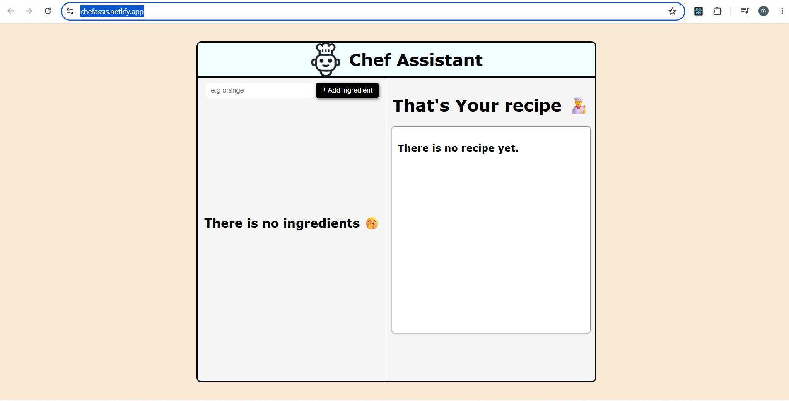

# Chef Assistant  
## description
This is an AI assistatn recommends a recipe according to the available ingredients using AI model. 

## Tech stack
- React.
- Css.
- Javascript
- Vite.
- Groq AI API.
## How it works.
First the user fills the input field, when he clicks the add button it updates the state only whe the field contains data. the added ingredient is rendered on the screen using map method. when the user enters 4 ingredients, get recipe button appears. When it clicked, the button activate the function which calls the API. there are two masseges are sent, one contains fixed instructions from the system, and the other one from the user, which contains the list of ingredients. The recipe renders only when there is a respond from the API Using asyncrouns programming.
## Motivation.
I created this project to practice state management and working with props in React. It also helped me better understand API calls, asynchronous programming, and how to integrate fetched data with component state.
## challenges
The main challenge was using the API, as it required a lot of time spent searching for a free model suitable for the project. Also, deciding the data flow took time. First, I put the ingredients state inside the input section, but I realized later it must be in the main to make the result section be able to access it and send the request to the API

